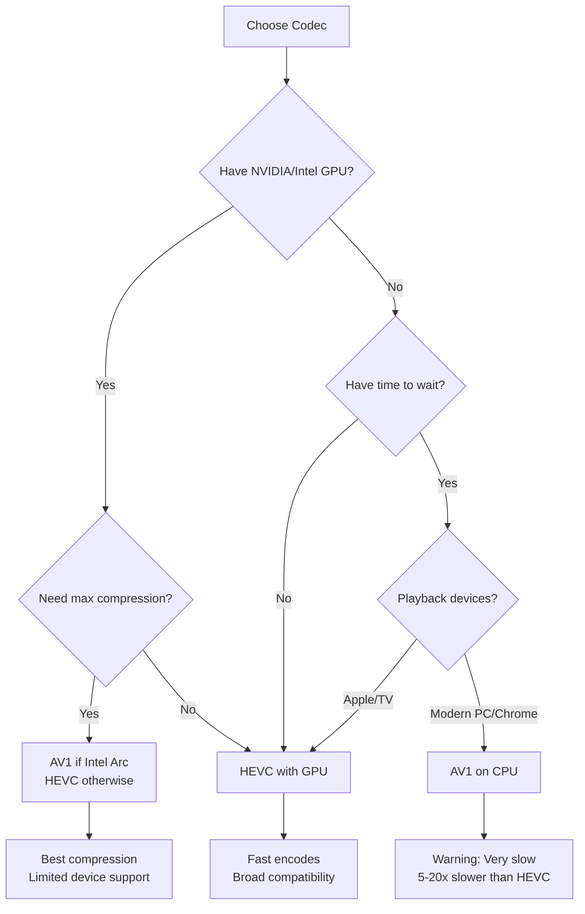

## Quick Comparison

Choose the right codec for your library based on encoding speed, file size, and device compatibility.

| Feature | HEVC (H.265) | AV1 |
|---------|-------------|-----|
| **File Size Reduction** | 40-60% smaller vs H.264 | 50-70% smaller vs H.264 |
| **Encoding Speed** | Fast (CPU/GPU) | Slow (CPU only) |
| **Hardware Acceleration** | NVIDIA, Intel, AMD | Limited (Intel Arc only) |
| **Device Compatibility** | Widespread (2015+) | Limited (2020+) |
| **Quality at Same Bitrate** | Good | Excellent |
| **Browser Playback** | Safari, Edge | Chrome, Firefox, Edge |
| **Smart TV Support** | Most 2016+ models | Few 2021+ models |
| **Best For** | Balanced speed + compatibility | Maximum storage savings |

<Info>
**TL;DR:** Use **HEVC** for faster encoding and broad device support. Use **AV1** for maximum space savings if you have time and modern playback devices.
</Info>

---

## When to Use HEVC

HEVC (H.265) is the **balanced choice** for most users who want significant file size reduction without sacrificing encoding speed or device compatibility.

### Ideal Scenarios

<Card title="Fast Encoding Required" icon="bolt">
Encoding large libraries (1000+ movies) where time matters more than maximum compression. HEVC encodes 5-20x faster than AV1.
</Card>

<Card title="Hardware Encoder Available" icon="microchip">
NVIDIA RTX 20/30/40 series, Intel 6th gen+, or AMD RX 6000+ GPUs provide 3-10x speedup with NVENC/QSV/VCE hardware acceleration.
</Card>

<Card title="Apple Ecosystem" icon="apple">
iPhone, iPad, Mac, Apple TV all support HEVC natively since 2016. Safari requires HEVC for efficient video streaming.
</Card>

<Card title="Smart TV Playback" icon="tv">
Most smart TVs from 2016+ support HEVC hardware decoding. Older or budget TVs often lack AV1 support.
</Card>

### HEVC Performance Examples

| Hardware | Resolution | Speed | Time for 2-hour movie |
|----------|-----------|-------|----------------------|
| Intel i5-12400 (CPU) | 1080p | 15-25 FPS | 45-75 minutes |
| Intel i9-13900K (CPU) | 1080p | 30-50 FPS | 25-40 minutes |
| NVIDIA RTX 3060 (GPU) | 1080p | 60-100 FPS | 12-20 minutes |
| NVIDIA RTX 4090 (GPU) | 4K | 80-120 FPS | 20-30 minutes |
| Intel i5-12400 (CPU) | 4K | 5-10 FPS | 3-5 hours |

<Tip>
Enable hardware acceleration in **Settings → Encoding** to unlock GPU speeds. HEVC on NVIDIA RTX 3060+ provides near-identical quality to CPU at 5-10x the speed.
</Tip>

### HEVC File Size Savings

Typical storage reduction when converting from H.264 to HEVC:

| Original Size | Resolution | HEVC Size | Savings |
|---------------|-----------|-----------|---------|
| 10 GB | 1080p BluRay | 5-6 GB | 40-50% |
| 20 GB | 4K BluRay | 8-10 GB | 50-60% |
| 2 GB | 1080p TV Episode | 1-1.2 GB | 40-50% |
| 50 GB | 4K HDR Remux | 20-25 GB | 50-60% |

<Check>
**Real example:** A 500-movie library (5 TB H.264) shrinks to **2.5 TB HEVC** in 2-3 days with NVIDIA RTX 3060.
</Check>

---

## When to Use AV1

AV1 delivers **maximum compression** at the cost of much slower encoding. Best for users with time to spare and modern playback devices.

### Ideal Scenarios

<Card title="Maximum Storage Savings" icon="hard-drive">
When disk space is expensive and you prioritize smallest file sizes over encoding speed. AV1 achieves 10-20% better compression than HEVC.
</Card>

<Card title="Future-Proofing Library" icon="sparkles">
AV1 is royalty-free and backed by Google, Netflix, Amazon. It's the long-term successor to HEVC with improving hardware support.
</Card>

<Card title="Chrome/Firefox Streaming" icon="chrome">
Web-based media servers (Plex, Jellyfin, Emby) benefit from AV1's native support in Chrome/Firefox for efficient browser playback.
</Card>

<Card title="Archival Encodes" icon="archive">
Encoding a library once for long-term storage where speed doesn't matter. AV1 provides best quality-per-byte for archival purposes.
</Card>

### AV1 Performance Examples

| Hardware | Resolution | Speed | Time for 2-hour movie |
|----------|-----------|-------|----------------------|
| Intel i5-12400 (CPU) | 1080p | 2-5 FPS | 4-8 hours |
| Intel i9-13900K (CPU) | 1080p | 5-10 FPS | 2-4 hours |
| AMD Ryzen 9 7950X (CPU) | 1080p | 6-12 FPS | 1.5-3 hours |
| Intel i9-13900K (CPU) | 4K | 1-3 FPS | 10-20 hours |
| Intel Arc A770 (GPU)* | 1080p | 20-40 FPS | 30-60 minutes |

<Warning>
**AV1 hardware encoding is rare.** Only Intel Arc GPUs (2022+) support AV1 encoding acceleration. Most users will encode on CPU at 1/10th the speed of HEVC.
</Warning>

### AV1 File Size Savings

Typical storage reduction when converting from H.264 to AV1:

| Original Size | Resolution | AV1 Size | Savings |
|---------------|-----------|----------|---------|
| 10 GB | 1080p BluRay | 4-5 GB | 50-60% |
| 20 GB | 4K BluRay | 6-8 GB | 60-70% |
| 2 GB | 1080p TV Episode | 0.8-1 GB | 50-60% |
| 50 GB | 4K HDR Remux | 15-20 GB | 60-70% |

<Check>
**Real example:** A 500-movie library (5 TB H.264) shrinks to **2 TB AV1** but takes **2-3 weeks** to encode on Intel i9 CPU.
</Check>

---

## Quality Settings (CRF Values)

Both HEVC and AV1 use **CRF (Constant Rate Factor)** to control quality. Lower CRF = higher quality + larger files.

| CRF Range | Quality | File Size | Use Case |
|-----------|---------|-----------|----------|
| **18-22** | Visually Lossless | Large (80-90% of source) | 4K HDR archival, reference quality |
| **23-28** | High Quality | Medium (40-60% of source) | **Recommended for most users** |
| **29-35** | Acceptable | Small (20-40% of source) | Low-bitrate streaming, mobile |
| **36+** | Low Quality | Very Small (10-20% of source) | Not recommended |

<Info>
**BitBonsai default: CRF 23** for both HEVC and AV1. This provides transparent quality indistinguishable from the source for most content.
</Info>

### CRF Comparison Examples

Encoding a 10 GB 1080p H.264 BluRay movie:

| CRF | HEVC Size | AV1 Size | Quality Notes |
|-----|-----------|----------|---------------|
| 18 | 8 GB | 7 GB | Visually identical to source |
| 23 | 5 GB | 4 GB | Transparent quality (default) |
| 28 | 3 GB | 2.5 GB | Minor banding in dark scenes |
| 33 | 1.5 GB | 1.2 GB | Visible compression artifacts |

<Tip>
**How to adjust CRF:** Settings → Encoding → Quality → CRF slider. Lower for archival quality, higher for streaming/mobile libraries.
</Tip>

### Recommended CRF by Content Type

| Content Type | Recommended CRF | Reasoning |
|--------------|----------------|-----------|
| **4K HDR Movies** | 20-23 | High detail, large screen viewing |
| **1080p Movies** | 23-26 | Balanced quality and size |
| **TV Shows** | 24-28 | Fast-paced action, smaller screens |
| **Animation** | 20-24 | Flat colors compress well, benefit from high quality |
| **Old DVDs** | 28-32 | Source already low quality, no benefit from low CRF |

---

## Hardware Transcoding

Hardware encoding uses GPU/iGPU for 3-10x speedup vs CPU. Quality is slightly lower but visually transparent for most content.

### NVIDIA NVENC (GeForce/RTX)

**Supported cards:** GTX 1650+, RTX 20/30/40 series

**Codecs:** HEVC only (no AV1 on consumer cards)

**Performance:** 5-10x faster than CPU

**Quality:** Near-identical to CPU at default settings

**Setup:**
1. Install NVIDIA drivers 450+
2. Settings → Encoding → Hardware Acceleration → Enable NVENC
3. Select HEVC codec
4. Start encoding (GPU usage visible in `nvidia-smi`)

| GPU Model | 1080p Speed | 4K Speed | Max Concurrent Jobs |
|-----------|-------------|----------|---------------------|
| GTX 1660 | 40-60 FPS | 10-15 FPS | 2-3 |
| RTX 3060 | 60-100 FPS | 20-30 FPS | 3-4 |
| RTX 4070 | 80-120 FPS | 30-40 FPS | 4-5 |
| RTX 4090 | 100-150 FPS | 40-60 FPS | 5-6 |

<Tip>
**NVENC quality tip:** Use preset `p7` (slowest) for best quality. Only 10-20% slower than `p4` but significantly better quality.
</Tip>

### Intel Quick Sync (QSV)

**Supported CPUs:** Intel 6th gen (Skylake) to 14th gen (Raptor Lake)

**Codecs:** HEVC, AV1 (Arc GPUs only)

**Performance:** 3-8x faster than CPU

**Quality:** Good (slightly lower than NVENC)

**Setup:**
1. Enable iGPU in BIOS (may require dummy HDMI plug)
2. Settings → Encoding → Hardware Acceleration → Enable QSV
3. Select HEVC codec
4. Docker: Pass `/dev/dri` device to container

| CPU/GPU Model | 1080p Speed | 4K Speed | AV1 Support |
|---------------|-------------|----------|-------------|
| Intel i5-12400 | 30-50 FPS | 8-12 FPS | No |
| Intel i9-13900K | 40-70 FPS | 12-18 FPS | No |
| Intel Arc A380 | 50-80 FPS | 15-25 FPS | Yes (AV1) |
| Intel Arc A770 | 80-120 FPS | 25-40 FPS | Yes (AV1) |

<Check>
**Intel Arc is the only consumer GPU with AV1 encoding.** If you want fast AV1 encodes, Arc A380/A750/A770 is your best option.
</Check>

### AMD VCE/VCN

**Supported GPUs:** RX 5000 series (VCN), RX 6000/7000 series (VCN 2.0/3.0)

**Codecs:** HEVC only (no AV1)

**Performance:** 3-6x faster than CPU

**Quality:** Lower than NVENC/QSV (noticeable in complex scenes)

**Setup:**
1. Install AMD drivers
2. Settings → Encoding → Hardware Acceleration → Enable VCE
3. Docker: Pass `/dev/dri` and `/dev/kfd` devices

| GPU Model | 1080p Speed | 4K Speed | Notes |
|-----------|-------------|----------|-------|
| RX 6600 XT | 30-50 FPS | 8-12 FPS | VCN 3.0 |
| RX 6800 XT | 40-70 FPS | 12-18 FPS | VCN 3.0 |
| RX 7900 XTX | 50-80 FPS | 15-25 FPS | VCN 3.0 |

<Warning>
AMD hardware encoders have lower quality than NVIDIA/Intel. Recommended only for non-critical encodes or when NVENC/QSV unavailable.
</Warning>

### Hardware vs CPU Quality Comparison

| Encoder | Quality | Speed | Recommendation |
|---------|---------|-------|----------------|
| **CPU (x264/x265)** | Excellent | Slow | Use for archival quality, small batches |
| **NVENC (NVIDIA)** | Near-identical | Very Fast | **Best balance of speed + quality** |
| **QSV (Intel)** | Good | Fast | Great for large batches, slightly lower quality |
| **VCE (AMD)** | Fair | Fast | Last resort, noticeable quality drop |

---

## Codec Compatibility Matrix

### Playback Device Support

| Device | HEVC (H.265) | AV1 |
|--------|-------------|-----|
| **iPhone/iPad** | ✅ Yes (iOS 11+) | ❌ No |
| **Mac (Apple Silicon)** | ✅ Yes (hardware decode) | ✅ Yes (M3+, software) |
| **Mac (Intel)** | ✅ Yes (7th gen+) | ❌ No |
| **Apple TV** | ✅ Yes (4K model+) | ❌ No |
| **Android Phone** | ✅ Yes (Android 5.0+) | ⚠️ Partial (Android 10+, software) |
| **Windows PC** | ✅ Yes | ✅ Yes (software decode) |
| **Chromebook** | ⚠️ Partial (software) | ✅ Yes (native support) |

### Smart TV Support

| TV Brand | HEVC (H.265) | AV1 |
|----------|-------------|-----|
| **Samsung** | ✅ 2016+ models | ⚠️ 2020+ high-end models only |
| **LG** | ✅ 2016+ models | ⚠️ 2019+ OLED models only |
| **Sony** | ✅ 2016+ models | ⚠️ 2021+ select models |
| **TCL** | ✅ 2017+ models | ⚠️ 2020+ Roku models |
| **Vizio** | ✅ 2016+ models | ❌ No |

<Warning>
**AV1 smart TV support is extremely limited.** If you watch on TV, use HEVC for guaranteed hardware decoding. AV1 may software-decode (slow, stuttering).
</Warning>

### Browser Support

| Browser | HEVC (H.265) | AV1 |
|---------|-------------|-----|
| **Chrome** | ⚠️ Windows 10+ only (software) | ✅ Yes (native) |
| **Firefox** | ❌ No (licensing issues) | ✅ Yes (native) |
| **Safari** | ✅ Yes (native, hardware) | ⚠️ Partial (macOS 14+, software) |
| **Edge** | ✅ Yes (native) | ✅ Yes (native) |

<Info>
**For web streaming (Plex, Jellyfin):** Use HEVC if users watch in Safari/Edge, AV1 if primarily Chrome/Firefox.
</Info>

### Media Server Support

| Server | HEVC (H.265) | AV1 |
|--------|-------------|-----|
| **Plex** | ✅ Direct play + transcode | ✅ Direct play (transcoding experimental) |
| **Jellyfin** | ✅ Full support | ✅ Full support (10.8+) |
| **Emby** | ✅ Full support | ⚠️ Partial support |
| **Kodi** | ✅ Yes (hardware decode) | ✅ Yes (19.0+, software) |
| **VLC** | ✅ Yes | ✅ Yes (3.0+) |

---

## Decision Flowchart



---

## Recommended Presets

### Fast Balanced (HEVC + GPU)

**Best for:** Large libraries, broad device support, fast encoding

```yaml
Codec: HEVC
CRF: 23
Hardware: NVENC/QSV
Speed: 60-100 FPS (1080p)
Encoding time: 500 movies in 2-3 days
File size: 40-50% reduction
```

### Maximum Compression (AV1 + CPU)

**Best for:** Small libraries, archival, modern devices

```yaml
Codec: AV1
CRF: 23
Hardware: CPU only
Speed: 2-5 FPS (1080p)
Encoding time: 500 movies in 2-3 weeks
File size: 50-60% reduction
```

### Ultra Quality Archival (HEVC + Low CRF)

**Best for:** Reference quality, 4K HDR collection

```yaml
Codec: HEVC
CRF: 18-20
Hardware: CPU or NVENC p7
Speed: 10-30 FPS (4K)
Encoding time: 100 4K movies in 1 week
File size: 20-30% reduction (high quality)
```

### Fast Streaming (HEVC + High CRF)

**Best for:** Mobile/web streaming, non-critical content

```yaml
Codec: HEVC
CRF: 28-30
Hardware: NVENC/QSV
Speed: 80-120 FPS (1080p)
Encoding time: 500 movies in 1-2 days
File size: 60-70% reduction (lower quality)
```

---

## Related Guides

- **[Hardware Requirements](/installation/requirements)** - Check GPU compatibility
- **[First Library Scan](/guides/first-scan)** - Queue videos for encoding
- **[Monitoring Progress](/guides/monitoring)** - Track encoding stats
- **[Multi-Node Setup](/advanced/multi-node)** - Speed up encoding with workers
