Scale BitBonsai's [transcoding](/glossary#transcoding) capacity by adding worker [nodes](/glossary#node) across multiple machines. Distribute [encoding](/glossary#encoding) [jobs](/glossary#job) automatically with zero manual intervention.

<Note>
**What is multi-node?** Running BitBonsai on multiple computers to encode videos faster. See [multi-node](/glossary#multi-node) in the glossary.
</Note>

## What is Multi-Node Encoding?

Multi-node encoding distributes video [transcoding](/glossary#transcoding) [jobs](/glossary#job) across multiple physical machines, dramatically reducing total encoding time.

**How it works:**
- **[Main Node](/glossary#main-node)**: Owns the PostgreSQL [database](/glossary#database), distributes jobs, hosts the web UI
- **[Child Nodes](/glossary#child-node)**: Worker-only nodes that pull jobs from the [main node](/glossary#main-node)'s [queue](/glossary#queue)
- **Shared Storage**: [NFS](/glossary#nfs) mount ensures all nodes access the same video files (zero-copy encoding)
- **Automatic [Load Balancing](/glossary#load-balancing)**: Jobs are distributed based on each node's current load and capacity

**Example:**
```
Main Node (192.168.1.100):
  - PostgreSQL database
  - Web UI (port 4210)
  - Encodes jobs (4 concurrent)

Child Node 1 (192.168.1.170):
  - Encodes jobs (8 concurrent)
  - Proxies API calls to main

Child Node 2 (192.168.1.171):
  - Encodes jobs (8 concurrent)
  - Proxies API calls to main

Total capacity: 20 concurrent encoding jobs
```

---

## Architecture

```mermaid
graph TD
    UI[🖥️ Web UI :4210] -->|API calls| Main[⚡ Main Node :3100<br/>Database Owner<br/>Job Distributor<br/>Web UI Host]
    Main -->|owns & manages| DB[(🗄️ PostgreSQL<br/>Job Queue<br/>Libraries<br/>Node Registry)]
    Main -->|reads/writes videos| NFS[📁 NFS Share<br/>/videos<br/>Shared Storage]

    Main -->|assigns jobs| Main
    Main -->|assigns jobs| Child1[👷 Child Node 1<br/>Worker Only<br/>8 concurrent jobs]
    Main -->|assigns jobs| Child2[👷 Child Node 2<br/>Worker Only<br/>8 concurrent jobs]

    Child1 -->|proxy API calls| Main
    Child2 -->|proxy API calls| Main

    Child1 -->|reads/writes videos| NFS
    Child2 -->|reads/writes videos| NFS

    style Main fill:#4CAF50,stroke:#2E7D32,stroke-width:3px,color:#000
    style Child1 fill:#2196F3,stroke:#1565C0,stroke-width:3px,color:#000
    style Child2 fill:#2196F3,stroke:#1565C0,stroke-width:3px,color:#000
    style NFS fill:#FF9800,stroke:#E65100,stroke-width:3px,color:#000
    style DB fill:#9C27B0,stroke:#6A1B9A,stroke-width:3px,color:#fff
    style UI fill:#FFC107,stroke:#F57F17,stroke-width:3px,color:#000
```



<Info>
**Key insight:** [Child nodes](/glossary#child-node) are **worker-only** - they don't have their own [database](/glossary#database). They fetch [jobs](/glossary#job) from the [main node](/glossary#main-node) and report back progress.
</Info>

### Key Components

| Component | Role | Responsibilities |
|-----------|------|------------------|
| **[Main Node](/glossary#main-node)** | Master + Worker | [Database](/glossary#database), [API](/glossary#api), UI, [job](/glossary#job) distribution, [encoding](/glossary#encoding) |
| **[Child Node](/glossary#child-node)** | Worker only | Fetch jobs, encode, report progress, proxy API calls |
| **[NFS](/glossary#nfs) Share** | Shared storage | Centralized video file access (no file copying) |
| **PostgreSQL** | State management | Job [queue](/glossary#queue), [libraries](/glossary#library), node registry |

---

## Prerequisites

Before setting up multi-node encoding, ensure:

<Steps>
  <Step title="Network Connectivity">
    All nodes must communicate on the same network:

    - **Port 3100** accessible from child nodes to main node (BitBonsai API)
    - **Port 2049** accessible from all nodes (NFS)
    - No firewall blocking inter-node traffic
  </Step>

  <Step title="Shared Storage (NFS)">
    Video files must be accessible from all nodes via NFS:

    - Main node exports `/videos` directory
    - Child nodes mount main node's `/videos` at the **same path**
    - Read/write permissions for all nodes
  </Step>

  <Step title="Same BitBonsai Version">
    All nodes must run **identical BitBonsai versions**.

    ```bash
    # Check version on each node
    docker exec bitbonsai-backend cat package.json | grep version
    ```
  </Step>

  <Step title="Sufficient Resources">
    Each child node should have:

    - **CPU**: 4+ cores (8+ recommended for concurrent encoding)
    - **RAM**: 8GB minimum (16GB+ recommended)
    - **Disk**: Fast temp storage (SSD/NVMe for encoding workspace)
  </Step>
</Steps>

<Warning>
**Critical:** All nodes MUST mount the NFS share at the **exact same path** (e.g., `/videos`). Path mismatches will cause "file not found" errors during encoding.
</Warning>

---

## Step 1: Setup NFS Share on Main Node

Export the video library from your main node so child nodes can access files.

### Install NFS Server (Main Node)

<Tabs>
  <Tab title="Ubuntu/Debian">
    ```bash
    sudo apt update
    sudo apt install nfs-kernel-server
    ```
  </Tab>

  <Tab title="Unraid">
    Unraid has NFS built-in. Enable via:

    1. **Settings** → **NFS**
    2. Enable NFS export
    3. Set export path to `/mnt/user/` (or specific share)
  </Tab>

  <Tab title="RHEL/CentOS">
    ```bash
    sudo yum install nfs-utils
    sudo systemctl enable --now nfs-server
    ```
  </Tab>
</Tabs>

### Configure NFS Export

Edit `/etc/exports` on the main node:

```bash /etc/exports
# Allow child nodes to mount /videos directory
/videos 192.168.1.0/24(rw,sync,no_subtree_check,no_root_squash)
```

**Explanation:**
- `/videos`: Path to export (adjust to your video library path)
- `192.168.1.0/24`: Network range (adjust to your subnet)
- `rw`: Read/write access
- `sync`: Synchronous writes (safer)
- `no_root_squash`: Preserve root permissions (needed for Docker containers)

### Apply Export Configuration

```bash
# Reload NFS exports
sudo exportfs -ra

# Verify export is active
sudo exportfs -v
```

Expected output:
```
/videos       192.168.1.0/24(rw,sync,wdelay,no_subtree_check,no_root_squash)
```

### Verify NFS Server is Running

```bash
sudo systemctl status nfs-server
```

---

## Step 2: Mount NFS Share on Child Nodes

Each child node must mount the main node's `/videos` directory.

### Install NFS Client (Child Nodes)

<Tabs>
  <Tab title="Ubuntu/Debian">
    ```bash
    sudo apt update
    sudo apt install nfs-common
    ```
  </Tab>

  <Tab title="RHEL/CentOS">
    ```bash
    sudo yum install nfs-utils
    ```
  </Tab>

  <Tab title="Docker Host">
    Most Docker hosts already have NFS support. Test with:
    ```bash
    mount -t nfs
    ```
  </Tab>
</Tabs>

### Create Mount Point

```bash
sudo mkdir -p /videos
```

### Mount NFS Share

```bash
# Mount temporarily (for testing)
sudo mount -t nfs 192.168.1.100:/videos /videos

# Verify mount succeeded
ls /videos
```

Replace `192.168.1.100` with your main node's IP address.

### Make Mount Persistent

Add to `/etc/fstab` for automatic mounting on boot:

```bash /etc/fstab
192.168.1.100:/videos /videos nfs defaults,_netdev 0 0
```

**Options:**
- `defaults`: Standard mount options
- `_netdev`: Wait for network before mounting
- `0 0`: No dump, no fsck check

Test the fstab entry:
```bash
sudo mount -a
df -h | grep videos
```

<Warning>
**Path Consistency Check:** Run this on ALL nodes (main + child):
```bash
ls -la /videos
```
All nodes must show the **same files**. Path mismatches will break multi-node encoding.
</Warning>

---

## Step 3: Deploy Child Node

Install BitBonsai on the child node in **linked mode** (worker-only, no database).

### Docker Compose for Child Node

Create `docker-compose.yml` on the child node:

```yaml docker-compose.yml
version: '3.8'

services:
  bitbonsai-backend:
    image: ghcr.io/bitbonsai/backend:latest
    container_name: bitbonsai-backend
    restart: unless-stopped
    environment:
      # Point to main node's API
      MAIN_NODE_URL: http://192.168.1.100:3100

      # Node identification
      NODE_NAME: child-node-1

      # Runtime config
      NODE_ENV: production
      PORT: 3100

      # Concurrent jobs (adjust based on CPU cores)
      MAX_CONCURRENT_JOBS: 8
    volumes:
      # Mount NFS share at SAME path as main node
      - /videos:/videos

      # Local temp storage (use fast disk)
      - /mnt/fast-storage/bitbonsai-temp:/tmp/bitbonsai
    ports:
      - "3100:3100"
    network_mode: bridge
```

<Note>
**Key Differences from Main Node:**
- No PostgreSQL container (uses main node's database)
- `MAIN_NODE_URL` points to main node API
- No frontend container needed (UI only on main node)
</Note>

### Environment Variables for Child Node

| Variable | Description | Example |
|----------|-------------|---------|
| `MAIN_NODE_URL` | Main node's API endpoint (required) | `http://192.168.1.100:3100` |
| `NODE_NAME` | Unique identifier for this child node | `child-node-1` |
| `MAX_CONCURRENT_JOBS` | Max parallel encoding jobs | `8` (adjust based on CPU cores) |
| `PORT` | API port (keep as 3100 for consistency) | `3100` |

### Start Child Node

```bash
# On child node
docker compose up -d

# Check logs
docker compose logs -f bitbonsai-backend
```

Look for:
```
[Nest] INFO [Bootstrap] Child node mode detected
[Nest] INFO [Bootstrap] Main node: http://192.168.1.100:3100
[Nest] INFO [Bootstrap] Application listening on port 3100
```

<Tip>
**Name your nodes descriptively:**
- `child-node-1`, `child-node-2` (generic)
- `basement-server`, `upstairs-pc` (location-based)
- `lxc-worker-300`, `lxc-worker-301` (infrastructure-based)
</Tip>

---

## Step 4: Link Child Node to Main Node

Register the child node with the main node using an API key.

### Generate API Key on Main Node

<Steps>
  <Step title="Open Web UI">
    Navigate to the main node's UI:
    ```
    http://192.168.1.100:4210
    ```
  </Step>

  <Step title="Navigate to Nodes Page">
    Click **Settings** → **Nodes** in the sidebar.
  </Step>

  <Step title="Add New Node">
    Click **Add Node** button.

    Fill in:
    - **Name**: `child-node-1` (must match `NODE_NAME` in docker-compose.yml)
    - **URL**: `http://192.168.1.170:3100` (child node's IP and port)
    - **Type**: `Worker`
  </Step>

  <Step title="Generate API Key">
    Click **Generate API Key**.

    Copy the displayed key (you'll only see it once):
    ```
    bb_1234567890abcdef1234567890abcdef
    ```
  </Step>

  <Step title="Save Configuration">
    Click **Save** to register the node.
  </Step>
</Steps>

### Configure Child Node with API Key

Add the API key to the child node's `docker-compose.yml`:

```yaml docker-compose.yml
services:
  bitbonsai-backend:
    environment:
      MAIN_NODE_URL: http://192.168.1.100:3100
      API_KEY: bb_1234567890abcdef1234567890abcdef  # Add this
      NODE_NAME: child-node-1
```

Restart the child node:
```bash
docker compose down
docker compose up -d
```

---

## Step 5: Verify Node Connection

Confirm the child node is connected and ready to receive jobs.

### Check Node Status in UI

<Steps>
  <Step title="Open Nodes Page">
    Navigate to **Settings** → **Nodes** in the main node's UI.
  </Step>

  <Step title="Verify Node Appears">
    You should see:

    | Node Name | Status | Current Load | Jobs Completed |
    |-----------|--------|--------------|----------------|
    | Main Node | Online | 2/4 | 150 |
    | child-node-1 | Online | 0/8 | 0 |
  </Step>

  <Step title="Check Health Status">
    Status should be **Online** (green indicator).

    If **Offline** (red), check:
    - Child node is running: `docker ps`
    - Network connectivity: `curl http://192.168.1.170:3100/health`
    - API key is correct in docker-compose.yml
  </Step>
</Steps>

### Test Job Distribution

Start a library scan or encoding job and monitor the **Jobs** page. Jobs should distribute across nodes automatically.

**Example distribution:**
```
Job #1 → Main Node
Job #2 → child-node-1
Job #3 → child-node-1
Job #4 → Main Node
```

<Tip>
Watch the **Current Load** column in the Nodes page to see real-time job distribution.
</Tip>

---

## Load Balancing

BitBonsai automatically distributes jobs based on node capacity and current load. No manual configuration needed.

### How Jobs are Distributed

1. **Node Selection:** When a job is ready to encode, the system picks the node with the **lowest current load**
2. **Load Calculation:** Load = (Active Jobs / Max Concurrent Jobs)
3. **Capacity Aware:** Nodes with higher `MAX_CONCURRENT_JOBS` receive more jobs
4. **Health Checks:** Offline nodes are skipped automatically

### Load Balancing Algorithm

```
Available Nodes:
  - Main Node:  2/4 jobs  → Load = 0.50
  - Child Node: 3/8 jobs  → Load = 0.375

Next job assigned to: Child Node (lowest load)
```

<Note>
Load balancing happens **automatically** in the background. You never need to manually assign jobs to nodes.
</Note>

### Optimizing Load Distribution

**Scenario:** One node is more powerful than others.

**Solution:** Increase `MAX_CONCURRENT_JOBS` on the powerful node:

```yaml
# Powerful child node (16-core CPU)
environment:
  MAX_CONCURRENT_JOBS: 12

# Weaker child node (4-core CPU)
environment:
  MAX_CONCURRENT_JOBS: 4
```

The powerful node will automatically receive more jobs due to higher capacity.

---

## Node Management

### Pause a Node

Temporarily stop a node from receiving new jobs without shutting it down.

<Steps>
  <Step title="Navigate to Nodes Page">
    **Settings** → **Nodes**
  </Step>

  <Step title="Click Pause Icon">
    Click the **Pause** button next to the node name.
  </Step>

  <Step title="Verify Status">
    Status changes to **Paused**.

    - Current jobs finish normally
    - No new jobs assigned
  </Step>

  <Step title="Resume Node">
    Click **Resume** to re-enable job assignment.
  </Step>
</Steps>

<Tip>
Use **Pause** when performing maintenance (updates, reboots) without removing the node entirely.
</Tip>

### Remove a Node

Permanently unlink a child node from the main node.

<Steps>
  <Step title="Pause Node First">
    Ensure the node is **Paused** so no new jobs start.
  </Step>

  <Step title="Wait for Jobs to Complete">
    Check the node has **0 active jobs** before removal.
  </Step>

  <Step title="Delete Node">
    Click the **Delete** (trash icon) button.

    Confirm deletion in the popup.
  </Step>

  <Step title="Shutdown Child Node">
    On the child node machine:
    ```bash
    docker compose down
    ```
  </Step>
</Steps>

<Warning>
Removing a node while it has active jobs will cause those jobs to fail. Always pause and wait for completion first.
</Warning>

### Update a Child Node

Keep child nodes in sync with the main node's version.

```bash
# On child node
docker compose pull
docker compose down
docker compose up -d
```

<Note>
Database migrations run automatically on the **main node only**. Child nodes inherit schema changes via API.
</Note>

---

## Troubleshooting Multi-Node Issues

### Child Node Shows Offline

**Symptom:** Node appears as **Offline** in Nodes page.

**Solutions:**

<AccordionGroup>
  <Accordion title="Verify Network Connectivity">
    From main node, test connectivity:
    ```bash
    curl http://192.168.1.170:3100/health
    ```

    Should return: `{"status":"ok"}`

    If connection refused:
    - Check child node is running: `docker ps`
    - Verify port 3100 is not blocked by firewall
  </Accordion>

  <Accordion title="Check API Key">
    Ensure API key matches:

    1. View registered key in main node's Nodes page
    2. Compare with child node's `docker-compose.yml`
    3. Keys must match exactly (case-sensitive)
  </Accordion>

  <Accordion title="Verify MAIN_NODE_URL">
    Check child node's environment:
    ```bash
    docker exec bitbonsai-backend printenv MAIN_NODE_URL
    ```

    Should return: `http://192.168.1.100:3100`

    If incorrect, update `docker-compose.yml` and restart.
  </Accordion>

  <Accordion title="Check Child Node Logs">
    ```bash
    docker compose logs -f bitbonsai-backend
    ```

    Look for connection errors:
    ```
    [ERROR] Failed to connect to main node: ECONNREFUSED
    ```
  </Accordion>
</AccordionGroup>

---

### NFS Mount Failures

**Symptom:** Encoding fails with "file not found" errors.

**Solutions:**

<AccordionGroup>
  <Accordion title="Verify NFS Mount">
    On child node:
    ```bash
    df -h | grep videos
    mount | grep videos
    ```

    Should show:
    ```
    192.168.1.100:/videos on /videos type nfs
    ```

    If not mounted:
    ```bash
    sudo mount -a
    ```
  </Accordion>

  <Accordion title="Check Path Consistency">
    Run on **all nodes** (main + child):
    ```bash
    ls -la /videos
    ```

    All nodes must show **identical files**. If different:
    - Verify NFS export path on main node
    - Check mount point is `/videos` on all child nodes
  </Accordion>

  <Accordion title="Test File Access from Container">
    Inside child node container:
    ```bash
    docker exec bitbonsai-backend ls /videos
    ```

    Should list video files. If empty:
    - Verify NFS mount happened **before** container started
    - Restart container: `docker compose restart`
  </Accordion>

  <Accordion title="Check NFS Permissions">
    On main node, verify export allows read/write:
    ```bash
    sudo exportfs -v
    ```

    Should include `rw` (read/write) and `no_root_squash`.
  </Accordion>
</AccordionGroup>

---

### Jobs Stuck on One Node

**Symptom:** All jobs go to main node, child nodes idle.

**Solutions:**

<AccordionGroup>
  <Accordion title="Check Child Node Status">
    In Nodes page, verify child node is:
    - **Online** (not Paused or Offline)
    - Has capacity: Current Jobs < Max Jobs
  </Accordion>

  <Accordion title="Verify MAX_CONCURRENT_JOBS">
    Check child node environment:
    ```bash
    docker exec bitbonsai-backend printenv MAX_CONCURRENT_JOBS
    ```

    If `0` or unset, jobs won't be assigned. Set in docker-compose.yml:
    ```yaml
    environment:
      MAX_CONCURRENT_JOBS: 8
    ```
  </Accordion>

  <Accordion title="Check Job Queue">
    In main node's Jobs page:
    - Are there jobs in **QUEUED** status?
    - If no queued jobs, distribution is working (all jobs active)
  </Accordion>

  <Accordion title="Review Node Health">
    Check child node logs for errors:
    ```bash
    docker compose logs | grep ERROR
    ```

    Common issue: NFS mount failed during encoding, node auto-disabled.
  </Accordion>
</AccordionGroup>

---

### Version Mismatch Errors

**Symptom:** Child node logs show API compatibility errors.

**Solutions:**

1. **Check versions** on all nodes:
   ```bash
   docker exec bitbonsai-backend cat package.json | grep version
   ```

2. **Update all nodes** to same version:
   ```bash
   docker compose pull
   docker compose up -d
   ```

3. **Verify main node database** is migrated:
   ```bash
   # Main node only
   docker compose logs bitbonsai-backend | grep Migration
   ```

<Warning>
Always update the **main node first**, then child nodes. Database migrations only run on the main node.
</Warning>

---

### Network Latency Issues

**Symptom:** Slow job updates, delayed status changes.

**Solutions:**

<AccordionGroup>
  <Accordion title="Test Network Latency">
    From child node to main node:
    ```bash
    ping -c 10 192.168.1.100
    ```

    Latency should be <5ms for local network.
  </Accordion>

  <Accordion title="Check NFS Performance">
    Test read/write speed:
    ```bash
    # Write test
    dd if=/dev/zero of=/videos/test.bin bs=1M count=1000

    # Read test
    dd if=/videos/test.bin of=/dev/null bs=1M

    # Cleanup
    rm /videos/test.bin
    ```

    Should be >100 MB/s for Gigabit network.
  </Accordion>

  <Accordion title="Optimize NFS Mount">
    Add performance options to `/etc/fstab`:
    ```bash
    192.168.1.100:/videos /videos nfs rsize=8192,wsize=8192,timeo=14,_netdev 0 0
    ```

    Remount:
    ```bash
    sudo umount /videos
    sudo mount -a
    ```
  </Accordion>
</AccordionGroup>

---

## Best Practices

### Network Configuration

<CardGroup cols={2}>
  <Card title="Use Gigabit Ethernet" icon="network-wired">
    Multi-node encoding requires high bandwidth for NFS file access. Use 1Gbps+ wired connections (avoid WiFi).
  </Card>

  <Card title="Dedicated VLAN" icon="diagram-project">
    Isolate BitBonsai nodes on a dedicated VLAN to avoid network congestion from other traffic.
  </Card>

  <Card title="Static IPs" icon="hashtag">
    Assign static IPs to all nodes to prevent connection failures after DHCP lease renewal.
  </Card>

  <Card title="Low Latency" icon="gauge-high">
    Keep nodes on the same physical switch (<1ms latency) for optimal performance.
  </Card>
</CardGroup>

### Storage Configuration

<CardGroup cols={2}>
  <Card title="Fast NFS Server" icon="server">
    Use SSD/NVMe storage for the NFS export to minimize read/write latency.
  </Card>

  <Card title="Local Temp Storage" icon="hard-drive">
    Mount `/tmp/bitbonsai` to local fast storage (not NFS) for encoding workspace.
  </Card>

  <Card title="Regular NFS Health Checks" icon="heart-pulse">
    Monitor NFS mount status with automated checks to detect silent failures.
  </Card>

  <Card title="Backup Before Scaling" icon="cloud-arrow-up">
    Backup your database before adding child nodes in case of configuration errors.
  </Card>
</CardGroup>

### Node Sizing

**General Guidelines:**

| Node Type | CPU Cores | RAM | Concurrent Jobs |
|-----------|-----------|-----|-----------------|
| Main Node | 4-8 cores | 16GB | 4 |
| Light Worker | 4-8 cores | 8GB | 4 |
| Heavy Worker | 12-16 cores | 16GB+ | 8-12 |
| GPU Worker | 8+ cores | 16GB+ | 6-8 (with GPU) |

<Tip>
**Rule of thumb:** Set `MAX_CONCURRENT_JOBS` to 50-75% of CPU core count. Encoding is CPU-intensive and over-subscribing degrades performance.
</Tip>

---

## Next Steps

<CardGroup cols={2}>
  <Card title="Hardware Acceleration" icon="microchip" href="/advanced/gpu-encoding">
    Enable GPU encoding on worker nodes for 3-5x speed boost
  </Card>

  <Card title="Monitoring & Alerts" icon="chart-line" href="/guides/monitoring">
    Track node health and encoding throughput
  </Card>

  <Card title="Troubleshooting Guide" icon="wrench" href="/advanced/troubleshooting">
    Diagnose and fix common multi-node issues
  </Card>

  <Card title="Performance Tuning" icon="gauge-high" href="/advanced/performance">
    Optimize encoding settings for quality vs. speed
  </Card>
</CardGroup>
