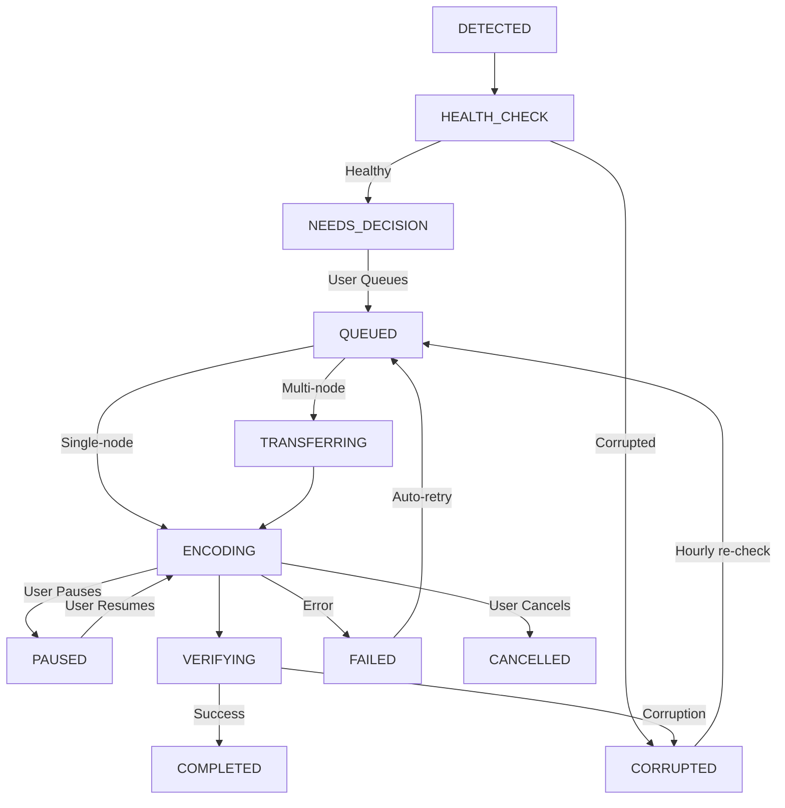

Every video goes through a multi-stage lifecycle from detection to completion. BitBonsai manages this automatically with zero user intervention required.

<Note>
  **What is a job?** A job is a single video file being encoded. Each video in your library becomes
  one job. See [glossary](/glossary#job) for more details.
</Note>

## Job Lifecycle

| Status             | Description                              | What Happens Next                     |
| ------------------ | ---------------------------------------- | ------------------------------------- |
| **DETECTED**       | File found during library scan           | Health check runs automatically       |
| **HEALTH_CHECK**   | Validating file integrity                | Moves to NEEDS_DECISION or FAILED     |
| **NEEDS_DECISION** | Waiting for user to queue                | User selects codec and queues         |
| **QUEUED**         | Waiting for worker node                  | Starts encoding when node available   |
| **TRANSFERRING**   | (Multi-node only) Copying to worker      | Starts encoding after transfer        |
| **ENCODING**       | Currently being encoded                  | Progress updates in real-time         |
| **PAUSED**         | User paused encoding                     | Resumes when user clicks Resume       |
| **VERIFYING**      | Checking output file health              | Moves to COMPLETED or FAILED          |
| **COMPLETED**      | Successfully encoded                     | Original backed up, file replaced     |
| **FAILED**         | Encoding error occurred                  | Auto-retries 3x, then stops           |
| **CORRUPTED**      | File failed health check or verification | Hourly auto-requeue for re-validation |
| **CANCELLED**      | User cancelled job                       | Removed from queue                    |

### Lifecycle Flow Diagram

<Info>
  Most jobs go: **DETECTED** → **HEALTH_CHECK** → **NEEDS_DECISION** → **QUEUED** → **ENCODING** →
  **VERIFYING** → **COMPLETED**. The whole process is automatic after you click "Queue Selected."
</Info>

## Job Status Details

For detailed information about each job status, see [Job Status Reference](/guides/jobs/status).

## Auto-Healing

BitBonsai includes multiple self-healing mechanisms. See [Auto-Healing Features](/guides/jobs/auto-healing).

## Troubleshooting

Common job issues and solutions:

- [Job stuck in QUEUED](/guides/jobs/troubleshooting#job-stuck-in-queued)
- [Job stuck in ENCODING at 0%](/guides/jobs/troubleshooting#job-stuck-in-encoding-at-0)
- [Job failed with "Disk Full"](/guides/jobs/troubleshooting#job-failed-with-disk-full)
- [Job failed with "Source Corrupted"](/guides/jobs/troubleshooting#job-failed-with-source-corrupted)
- [Completed job but file still H.264](/guides/jobs/troubleshooting#completed-job-but-file-still-h264)

## Related Guides

- **[Add Your First Library](/guides/first-scan)** - Scan and queue videos
- **[Monitoring Progress](/guides/monitoring)** - Track encoding stats
- **[Multi-Node Setup](/advanced/multi-node)** - Scale encoding with workers
- **[Troubleshooting](/advanced/troubleshooting)** - Fix common issues
