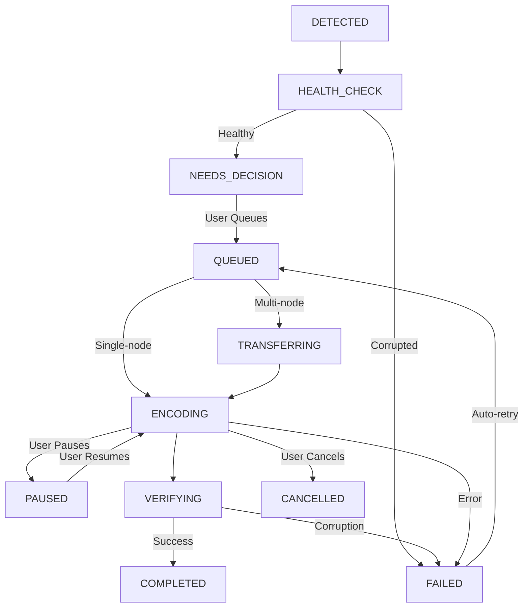

## Job Lifecycle

Every video goes through a multi-stage lifecycle from detection to completion. BitBonsai manages this automatically with zero user intervention required.

| Status | Description | What Happens Next |
|--------|-------------|-------------------|
| **DETECTED** | File found during library scan | Health check runs automatically |
| **HEALTH_CHECK** | Validating file integrity | Moves to NEEDS_DECISION or FAILED |
| **NEEDS_DECISION** | Waiting for user to queue | User selects codec and queues |
| **QUEUED** | Waiting for worker node | Starts encoding when node available |
| **TRANSFERRING** | (Multi-node only) Copying to worker | Starts encoding after transfer |
| **ENCODING** | Currently being encoded | Progress updates in real-time |
| **PAUSED** | User paused encoding | Resumes when user clicks Resume |
| **VERIFYING** | Checking output file health | Moves to COMPLETED or FAILED |
| **COMPLETED** | Successfully encoded | Original backed up, file replaced |
| **FAILED** | Encoding error occurred | Auto-retries 3x, then stops |
| **CANCELLED** | User cancelled job | Removed from queue |

### Lifecycle Flow Diagram



<Info>
Most jobs go: **DETECTED** → **HEALTH_CHECK** → **NEEDS_DECISION** → **QUEUED** → **ENCODING** → **VERIFYING** → **COMPLETED**. The whole process is automatic after you click "Queue Selected."
</Info>

---

## Job Status Details

### DETECTED
- **What it means:** File found during library scan
- **User action:** None (automatic)
- **Duration:** Milliseconds
- **Next step:** Health check runs automatically

### HEALTH_CHECK
- **What it means:** BitBonsai is validating file integrity with FFmpeg
- **Checks performed:**
  - File exists and is readable
  - Container format is valid (MP4, MKV, AVI, etc.)
  - Video/audio streams are decodable
  - Duration and metadata are accessible
  - No critical corruption in file structure
- **User action:** None (automatic)
- **Duration:** 1-5 seconds per file
- **Next step:**
  - **Healthy files** → NEEDS_DECISION
  - **Corrupted files** → FAILED (not queued)

<Tip>
Health checks prevent encoding failures by detecting corrupt files before wasting CPU time. Failed health checks are logged with detailed error messages.
</Tip>

### NEEDS_DECISION
- **What it means:** File is healthy and ready to encode
- **User action:** Select codec (HEVC/AV1) and click "Queue Selected"
- **Where to find:** Libraries → Queue tab
- **Filters available:**
  - Codec (find H.264 videos to upgrade)
  - Resolution (1080p, 4K, etc.)
  - Bitrate (target high-bitrate files)
  - File size (prioritize large files)

### QUEUED
- **What it means:** Job is waiting for an available worker node
- **User action:** None (automatic)
- **Duration:** Seconds to minutes (depends on queue depth)
- **Priority:** First-in, first-out (FIFO)
- **Next step:** Starts encoding when worker is free

<Info>
Queue depth is visible in the **Encoding** tab header: "3 queued, 2 encoding". Add more worker nodes to process queued jobs faster.
</Info>

### TRANSFERRING
- **What it means:** (Multi-node only) File is being copied to worker node
- **User action:** None (automatic)
- **Duration:** Depends on network speed and file size
- **Why this happens:** Some multi-node setups don't use shared storage (NFS), so files must be transferred before encoding
- **Next step:** Encoding starts after transfer completes

<Warning>
If you see many TRANSFERRING jobs, consider setting up NFS shared storage for instant zero-copy access. See [Multi-Node Setup](/advanced/multi-node).
</Warning>

### ENCODING
- **What it means:** FFmpeg is actively encoding the video
- **User action:** Monitor progress, or pause/cancel if needed
- **Duration:** Minutes to hours (depends on codec, resolution, and hardware)
- **What you see:**
  - Progress percentage (0-100%)
  - Estimated time remaining
  - Encoding speed (FPS)
  - Output file size estimate
  - Current vs. target bitrate

#### Progress Bar Breakdown

```
[████████████░░░░░░░░░░░░] 45% - 12:34 remaining
 │           │             │    └─ ETA based on current speed
 │           │             └─ Percentage complete
 │           └─ Empty portion (not yet encoded)
 └─ Filled portion (encoded)
```

#### Encoding Speed (FPS)

| Speed | Hardware | Codec | Notes |
|-------|----------|-------|-------|
| 5-15 FPS | CPU (Intel i5) | HEVC | Typical for 1080p movies |
| 20-40 FPS | CPU (Intel i7/i9) | HEVC | Fast encoding |
| 40-80 FPS | GPU (NVIDIA GTX 1660+) | HEVC | Hardware acceleration |
| 1-5 FPS | CPU | AV1 | Very slow but best quality |

<Tip>
**Slow encoding?** Check Settings → Hardware Acceleration and enable NVIDIA/Intel/AMD GPU encoding if available. HEVC on GPU is 3-10x faster than CPU.
</Tip>

### PAUSED
- **What it means:** User manually paused encoding
- **User action:** Click **Resume** to continue
- **Duration:** Indefinite (until user resumes)
- **Progress saved:** Yes, resumes from exact frame
- **Use case:** Free up CPU/GPU for other tasks temporarily

### VERIFYING
- **What it means:** Encoded file is being validated for corruption
- **Checks performed:**
  - Output file exists and is readable
  - FFprobe can parse container and streams
  - Duration matches original (within 2 seconds)
  - Video/audio streams are decodable
- **User action:** None (automatic)
- **Duration:** 1-3 seconds
- **Next step:**
  - **Healthy output** → COMPLETED
  - **Corrupted output** → FAILED (re-queued for retry)

<Warning>
If verification fails repeatedly (3+ retries), the source file may be corrupted. Check the original file with `ffprobe` or VLC for playback issues.
</Warning>

### COMPLETED
- **What it means:** Encoding succeeded and file replaced
- **User action:** None (automatic)
- **What happened:**
  1. Original file backed up to `/media/.bitbonsai/originals/[library]/[file]`
  2. Encoded file replaces original in library
  3. Library metadata updated (new codec, bitrate, file size)
  4. Job marked complete and removed from active queue
- **File location:** Same path as original (in-place replacement)
- **Backup location:** `[library-path]/.bitbonsai/originals/[relative-path]`

#### File Size Comparison

Typical savings after encoding:

| Original Codec | Target Codec | File Size Reduction |
|----------------|--------------|---------------------|
| H.264 (1080p)  | HEVC         | 40-50% smaller      |
| H.264 (1080p)  | AV1          | 50-60% smaller      |
| H.264 (4K)     | HEVC         | 50-60% smaller      |
| H.264 (4K)     | AV1          | 60-70% smaller      |

<Check>
**Example:** A 10 GB H.264 movie encoded to HEVC becomes ~5 GB (50% savings). No quality loss with default settings.
</Check>

### FAILED
- **What it means:** Encoding encountered an error
- **User action:**
  - Check error message in job details
  - Click **Retry** to manually retry
  - Auto-retries 3x before stopping
- **Common causes:**
  - Corrupted source file (skip it)
  - Insufficient disk space (free up space)
  - FFmpeg crash (bug in codec)
  - Hardware encoder failure (try CPU fallback)
- **Auto-retry behavior:**
  - 1st retry: Immediate
  - 2nd retry: 5 minutes later
  - 3rd retry: 15 minutes later
  - After 3 failures: Stops, requires manual retry

#### Error Categories

| Error Type | Cause | Fix |
|------------|-------|-----|
| **Source Corrupted** | Original file unreadable | Skip file or re-download |
| **Disk Full** | No space for output file | Free up space, job auto-retries |
| **Codec Error** | FFmpeg crash or unsupported stream | Try different codec (HEVC → AV1) |
| **Hardware Failure** | GPU encoder crash | Disable hardware accel in Settings |
| **Permission Denied** | Docker volume permissions | Fix with `chmod -R 777 /media` |

<Accordion title="View detailed error message">
1. Go to **Encoding** tab
2. Filter by **Failed** status
3. Click job row to expand details
4. Error message shows FFmpeg output with:
   - Error category
   - Root cause analysis
   - Suggested fix
   - Full FFmpeg stderr log

**Example error:**
```
Error Category: SOURCE_CORRUPTED
Message: Invalid data found when processing input
Suggestion: Source file may be corrupted. Try re-downloading or skip this file.
FFmpeg stderr: [mov,mp4,m4a,3gp,3g2,mj2 @ 0x...] moov atom not found
```
</Accordion>

### CANCELLED
- **What it means:** User manually cancelled encoding
- **User action:** Job is removed from queue
- **Progress lost:** Yes, cannot resume cancelled jobs
- **Use case:** Queued wrong file or changed mind about codec

---

## Job Details Panel

Click any job in the **Encoding** tab to view detailed information:

| Field | Description |
|-------|-------------|
| **Source File** | Full file path in library |
| **Target Codec** | HEVC (H.265), AV1, or VP9 |
| **Progress** | Percentage complete (0-100%) |
| **Speed** | Encoding speed in FPS |
| **Time Remaining** | ETA based on current speed |
| **Original Size** | File size before encoding |
| **Output Size** | Estimated file size after encoding |
| **Original Codec** | Source codec (usually H.264) |
| **Resolution** | Video resolution (1080p, 4K, etc.) |
| **Original Bitrate** | Source video bitrate (Mbps) |
| **Target Bitrate** | Output video bitrate (Mbps) |
| **Worker Node** | Which node is processing this job |
| **Started At** | When encoding began |
| **Error Message** | (FAILED jobs only) FFmpeg error details |

<Info>
**Pro tip:** Sort jobs by "Time Remaining" to see which jobs finish soonest. Large 4K movies may take hours, while 1080p TV episodes finish in 5-10 minutes.
</Info>

---

## Retry Failed Jobs

### Manual Retry

1. Go to **Encoding** tab
2. Filter by **Failed** status
3. Select jobs to retry (checkbox or **Select All**)
4. Click **Retry Selected** button
5. Jobs move back to QUEUED and restart

### Auto-Retry Behavior

BitBonsai automatically retries failed jobs **3 times** with exponential backoff:

| Attempt | Wait Time | Notes |
|---------|-----------|-------|
| 1st     | Immediate | Retry right away (transient errors) |
| 2nd     | 5 minutes | Wait before retry (disk space, network) |
| 3rd     | 15 minutes | Final retry before stopping |
| 4th+    | Manual only | Requires user intervention |

<Warning>
**Permanent failures (corrupted source files)** retry 3 times and stop. Check error message to determine if file should be skipped.
</Warning>

### Bulk Retry

Retry all failed jobs at once:

```bash
# Select all failed jobs in UI
1. Filter by "Failed"
2. Click "Select All" (top left)
3. Click "Retry Selected"
```

---

## Auto-Healing Features

BitBonsai includes multiple self-healing mechanisms to recover from errors automatically:

### 1. Orphaned Job Recovery (On Startup)

**Problem:** Container restarted mid-encoding → jobs stuck in ENCODING status

**Solution:** On backend startup, BitBonsai finds all jobs with status ENCODING and resets them to QUEUED

**When it runs:** Every backend container restart

**User action:** None (automatic)

**Logs:**
```
🔄 Orphaned job recovery: Reset 3 stuck ENCODING jobs to QUEUED
```

### 2. Temp File Detection (NFS Mount Recovery)

**Problem:** NFS mount not ready → job marks file as "not found" → FAILED

**Solution:** Before marking FAILED, retry 10 times with 2-second delays (20 seconds total)

**When it runs:** During encoding temp file checks

**User action:** None (automatic)

**Logs:**
```
🔄 Temp file not found, retrying (attempt 3/10)...
✓ Temp file detected after 6 seconds (NFS mount recovery)
```

<Info>
This prevents false FAILED status during NFS mount hiccups or slow network storage.
</Info>

### 3. Health Check Retry (Before Marking CORRUPTED)

**Problem:** Network hiccup during health check → false CORRUPTED status

**Solution:** Retry health check **5 times** with 2-second delays (10 seconds total)

**When it runs:** During HEALTH_CHECK and VERIFYING stages

**User action:** None (automatic)

**Why this matters:** Prevents wasting time re-checking healthy files

### 4. CORRUPTED Auto-Re-Validation (Hourly)

**Problem:** Files marked CORRUPTED during NFS hiccups are often actually healthy

**Solution:** Every hour, BitBonsai finds all CORRUPTED jobs and resets them to QUEUED for re-validation

**When it runs:** Hourly (cron job in backend)

**User action:** None (automatic)

**Logs:**
```
🔄 Auto-requeue: Found 12 CORRUPTED job(s) - resetting for re-validation
✓ Re-validated 12 jobs: 8 HEALTHY, 4 still CORRUPTED
```

<Tip>
**Why hourly?** NFS mounts often fail temporarily during network issues. Hourly re-checks catch files that become accessible again.
</Tip>

### 5. Stuck Job Watchdog (Detects Frozen Encodes)

**Problem:** FFmpeg crashes mid-encode but process doesn't exit → job stuck at same progress for hours

**Solution:** If progress hasn't changed in 15 minutes, job is marked FAILED and auto-retried

**When it runs:** Background watchdog every 5 minutes

**User action:** None (automatic)

**Logs:**
```
⚠️ Stuck job detected: Job #123 at 45% for 20 minutes → FAILED (auto-retry)
```

---

## Job History and Filtering

### Filter Jobs by Status

The **Encoding** tab has a status filter dropdown:

| Filter | Shows |
|--------|-------|
| **ALL** | Every job regardless of status |
| **QUEUED** | Waiting to start |
| **ENCODING** | Currently in progress |
| **COMPLETED** | Successfully finished |
| **FAILED** | Errors (manual retry available) |
| **CANCELLED** | User-cancelled jobs |

### Search Jobs

Use the search bar to find jobs by filename:

```
Example: Search "Inception" finds:
- Inception.2010.1080p.BluRay.x264.mkv
- Inception (2010) - Director's Cut.mp4
```

### Sort Jobs

Click column headers to sort:

| Column | Sort By |
|--------|---------|
| **File Name** | Alphabetical |
| **Progress** | Percentage (0-100%) |
| **Time Remaining** | ETA (soonest first) |
| **Speed** | FPS (fastest first) |
| **Status** | Status order (QUEUED → ENCODING → ...) |

<Tip>
**Quick wins:** Sort by "Time Remaining" (ascending) to see which jobs finish soonest. Great for prioritizing short encodes.
</Tip>

### Job History Retention

| Status | Retention |
|--------|-----------|
| **COMPLETED** | 30 days (configurable in Settings) |
| **FAILED** | 90 days (for debugging) |
| **CANCELLED** | 7 days |

Completed jobs older than retention period are auto-deleted from database but files remain in library.

---

## Troubleshooting

### Job stuck in QUEUED

**Symptom:** Jobs stay in QUEUED for minutes/hours

**Possible causes:**
- All worker nodes offline (check Nodes page)
- All nodes at max concurrency (add more nodes)
- Database connection lost (check backend logs)

**Fix:**
1. Go to **Nodes** page → check node status
2. If offline: Restart worker node containers
3. If online but idle: Check backend logs for errors
4. If all busy: Wait for current jobs to finish or add nodes

### Job stuck in ENCODING at 0%

**Symptom:** Job shows "Encoding" but progress stays at 0%

**Possible causes:**
- FFmpeg hasn't written first progress line yet (wait 10-20 seconds)
- FFmpeg crashed immediately (check logs)
- Source file extremely large (4K HDR movies take time to start)

**Fix:**
1. Wait 30 seconds (large files take time to initialize)
2. Check backend logs: `docker logs -f bitbonsai-backend`
3. If FFmpeg crashed: Error shows in logs, job auto-retries

### Job failed with "Disk Full"

**Symptom:** Job fails with error "No space left on device"

**Fix:**
1. Free up disk space (delete old files, empty trash)
2. Check available space: `df -h /media`
3. Job auto-retries in 5 minutes (no manual action needed)

<Warning>
BitBonsai needs temporary space for encoding. Ensure **at least 2x the largest file size** is free on the volume.
</Warning>

### Job failed with "Source Corrupted"

**Symptom:** Job fails immediately with "Invalid data found when processing input"

**Possible causes:**
- Original file is actually corrupted (download error, disk failure)
- Unsupported codec or container format
- Partial file (download not complete)

**Fix:**
1. Test file in VLC or `ffprobe`:
   ```bash
   ffprobe /path/to/file.mkv
   ```
2. If file plays in VLC but fails FFprobe: Report bug (rare)
3. If file doesn't play: Re-download or skip this file

### Completed job but file still H.264

**Symptom:** Job shows COMPLETED but file codec didn't change

**Possible causes:**
- Original wasn't replaced (backup failed)
- Viewing cached metadata in file explorer (refresh)

**Fix:**
1. Check file info: `ffprobe /path/to/file.mkv`
2. Check backup exists: `/media/.bitbonsai/originals/[file]`
3. If backup exists but file not replaced: Report bug

---

## Related Guides

- **[Add Your First Library](/guides/first-scan)** - Scan and queue videos
- **[Monitoring Progress](/guides/monitoring)** - Track encoding stats
- **[Multi-Node Setup](/advanced/multi-node)** - Scale encoding with workers
- **[Troubleshooting](/advanced/troubleshooting)** - Fix common issues
