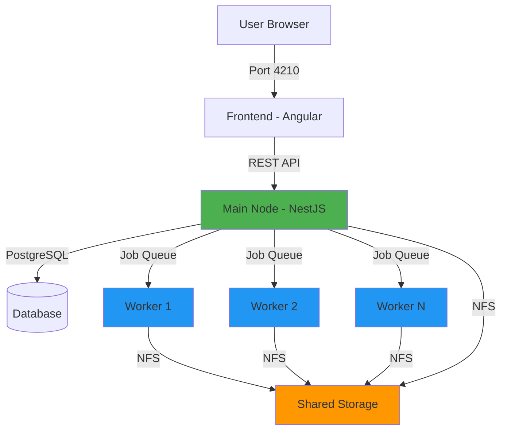

# What is BitBonsai?

BitBonsai automatically converts your video library to modern codecs (HEVC/AV1) with zero configuration.

## What BitBonsai Does

BitBonsai monitors your video libraries and automatically transcodes them to modern, efficient codecs like HEVC (H.265) and AV1. Point it at your Plex, Jellyfin, or personal video collections, and it handles the rest—detecting new files, queuing them for encoding, and replacing originals with compressed versions that maintain visual quality while dramatically reducing file sizes.

Unlike traditional transcoding tools that require complex configuration, BitBonsai uses smart defaults optimized for 99% of users. Add a folder, click encode, done.

## Why Use BitBonsai

<CardGroup cols={2}>
  <Card title="Massive Storage Savings" icon="hard-drive">
    Reduce video libraries by **40-70%** without visible quality loss. A 100GB collection becomes 30-60GB.
  </Card>
  <Card title="Modern Codec Support" icon="film">
    HEVC (H.265) and AV1 encoding with hardware acceleration (Intel QuickSync, NVIDIA NVENC, AMD VCE).
  </Card>
  <Card title="100% Self-Hosted" icon="server">
    Your videos never leave your infrastructure. No cloud services, no external APIs, no data leaks.
  </Card>
  <Card title="Zero Maintenance" icon="wand-magic-sparkles">
    Self-healing architecture auto-recovers from failures, validates outputs, and retries corrupted jobs.
  </Card>
</CardGroup>

## Key Differentiators

### Zero Configuration
Smart defaults that work for 99% of users. No codec parameters, no bitrate calculations, no quality tuning. The system auto-detects hardware acceleration and selects optimal settings.

### Self-Healing
Automatic recovery from failures without user intervention:
- **Orphaned Job Recovery**: Resets stuck jobs on startup
- **Corruption Detection**: Validates encoded files with automated re-tries
- **NFS Mount Recovery**: Handles temporary network storage issues
- **Stuck Job Watchdog**: Detects and recovers stalled encodes

### TRUE RESUME
Industry-leading resume capability. If a 2-hour movie fails at 95% completion, BitBonsai picks up exactly where it left off—not from 0%. Uses FFmpeg's `-ss` input seeking + frame-accurate validation to resume mid-encode.

Other tools restart from scratch. BitBonsai saves hours.

### Multi-Node Scaling
Distribute encoding across multiple machines with **zero-copy architecture**:
- Main node: Database, API, frontend
- Worker nodes: Encoding only (LXC containers, VMs, bare metal)
- NFS shared storage: All nodes access files directly (no copying)

Add nodes with a single config change. Load balancing happens automatically.

## Use Cases

<AccordionGroup>
  <Accordion title="Plex/Jellyfin Media Servers">
    Reduce storage costs and improve streaming performance. Smaller files mean faster loading, less buffering, and lower bandwidth usage for remote users.

    **Example**: 10TB Plex library → 4TB after HEVC encoding → Save 6TB of storage.
  </Accordion>

  <Accordion title="Personal Video Archives">
    Preserve family videos, home movies, and legacy footage efficiently. Modern codecs ensure files stay playable for decades while using minimal space.

    **Example**: 500GB of family videos (1990-2020) → 150GB compressed, ready for cloud backup.
  </Accordion>

  <Accordion title="Content Creators">
    Prepare video libraries for distribution. Encode masters to delivery formats without manual FFmpeg scripting.

    **Example**: Batch-encode 200 tutorial videos to HEVC for upload to platforms.
  </Accordion>

  <Accordion title="Home Media Labs">
    Experiment with codecs, quality presets, and hardware acceleration. Compare HEVC vs AV1 quality on your content.

    **Example**: Test Intel QuickSync vs NVIDIA NVENC on identical files to find optimal settings.
  </Accordion>
</AccordionGroup>

## Architecture Overview

**Components:**

| Component | Purpose | Location |
|-----------|---------|----------|
| **Main Node** | Database, API, frontend, job distribution | Primary server (Unraid, Ubuntu, etc.) |
| **Worker Nodes** | Encoding only, no database | LXC containers, VMs, bare metal |
| **Shared Storage** | NFS mount for zero-copy file access | NAS, local storage with NFS export |
| **PostgreSQL** | Job state, libraries, encoding history | Main node (Docker container) |

**Data Flow:**
1. Frontend scans library folder via API
2. Main node creates jobs in database
3. Workers poll for jobs, encode files on NFS
4. Workers update job status (progress, completion)
5. Main node validates output, marks job complete

## Quick Comparison vs Alternatives

| Feature | BitBonsai | Tdarr | FileFlows |
|---------|-----------|-------|-----------|
| **Zero Config** | ✅ Yes (smart defaults) | ❌ No (complex UI) | ❌ No (flow builder) |
| **TRUE RESUME** | ✅ Yes (frame-accurate) | ❌ No (restart from 0%) | ⚠️ Limited (chunk-based) |
| **Multi-Node** | ✅ Yes (NFS, zero-copy) | ✅ Yes (node system) | ❌ No |
| **Self-Healing** | ✅ Yes (auto-retry, validation) | ❌ No (manual intervention) | ❌ No |
| **Hardware Accel** | ✅ Auto-detected | ✅ Manual config | ✅ Manual config |
| **Setup Time** | 5 minutes (Docker Compose) | 30+ minutes (configuration) | 20+ minutes (flows) |
| **License** | MIT (open source) | Free + Paid tiers | Free + Paid tiers |

**When to choose BitBonsai:**
- You want automatic encoding with minimal setup
- You need true resume for long files (4K movies, archives)
- You value self-healing over manual troubleshooting
- You're building a multi-node encoding cluster

**When to choose alternatives:**
- You need complex conditional logic (Tdarr plugins, FileFlows flows)
- You want health checks (video corruption detection pre-encode)
- You need built-in library management (Tdarr's UI)

## Key Features

- **5 Minute Setup** - Docker Compose, add folder, done
- **Zero Config** - Smart defaults for everyone
- **Self-Healing** - Auto-recovers from failures

## Quick Start

[Install with Docker](/installation/docker) | [Install on Unraid](/installation/unraid)
